# Solution Dependency Graph

Generated from `ProjectReference` / `PackageReference` entries across all 24 projects.

## Project graph

```mermaid
graph BT
  classDef foundation fill:#1e3a5f,stroke:#4a90d9,color:#fff
  classDef native fill:#4a2545,stroke:#a35c9a,color:#fff
  classDef core fill:#1f4a3c,stroke:#4caf82,color:#fff
  classDef platform fill:#5a4520,stroke:#d4a03c,color:#fff
  classDef app fill:#3d2f52,stroke:#8b6cb8,color:#fff
  classDef test fill:#4a2020,stroke:#c25555,color:#fff
  classDef orphan fill:#333,stroke:#777,color:#aaa

  Glfw[Glfw.NET]:::native
  OpenGL[OpenGL.NET]:::native
  Metal[ZGF.Rendering.Metal]:::native

  Png[PngSharp]:::foundation
  Geometry[ZGF.Geometry]:::foundation
  AppUtils[ZGF.AppUtils]:::foundation
  Fonts[ZGF.Fonts]:::foundation
  Keyboard[ZGF.KeyboardModule]:::foundation
  Svg[ZGF.Svg]:::foundation

  Spatial[ZGF.Spatial]:::orphan
  Generator[ZGF.Gui.Generator]:::orphan

  KbGlfw[ZGF.KeyboardModule.GlfwAdapter]:::foundation
  Gui[ZGF.Gui]:::core
  Desktop[ZGF.Desktop]:::platform
  GuiMetal[ZGF.Gui.Metal]:::platform
  GuiDesktop[ZGF.Gui.Desktop]:::platform
  Testing[ZGF.Gui.Testing]:::platform

  Prototype[ZGF.Gui.Prototype]:::app
  MemDiag[ZGF.Gui.MemoryDiagnostics]:::app
  iOS[ZGF.Gui.iOS.SmokeTest]:::app
  Bench[ZGF.Gui.Benchmarks]:::app
  GuiTests[ZGF.Gui.Tests]:::test
  SvgTests[ZGF.Svg.Tests]:::test
  PngTests[PngSharp.Tests]:::test

  Spatial --> Geometry
  KbGlfw --> Glfw
  KbGlfw --> Keyboard

  Gui --> Png
  Gui --> AppUtils
  Gui --> Fonts
  Gui --> Geometry
  Gui --> Keyboard
  Gui --> Svg

  Desktop --> Glfw
  Desktop --> OpenGL
  Desktop --> KbGlfw
  Desktop --> Keyboard
  Desktop --> Metal

  GuiMetal --> Gui
  GuiMetal --> Metal
  GuiMetal --> Fonts
  GuiMetal --> Geometry
  GuiMetal --> AppUtils
  GuiMetal --> Png

  GuiDesktop --> Gui
  GuiDesktop --> GuiMetal
  GuiDesktop --> Desktop
  GuiDesktop --> Metal
  GuiDesktop --> OpenGL
  GuiDesktop --> Png
  GuiDesktop --> AppUtils
  GuiDesktop --> Fonts
  GuiDesktop --> Geometry
  GuiDesktop --> Keyboard

  Testing --> Gui
  Testing --> GuiDesktop
  Testing --> Keyboard
  Testing --> Geometry
  Testing --> Fonts
  Testing --> Png

  Prototype --> Gui
  Prototype --> GuiDesktop
  Prototype --> Desktop
  Prototype --> Geometry

  MemDiag --> Gui
  MemDiag --> GuiDesktop
  MemDiag --> Desktop
  MemDiag --> Geometry

  iOS --> Gui
  iOS --> GuiMetal
  iOS --> Metal

  Bench --> Gui
  GuiTests --> Gui
  GuiTests --> GuiDesktop
  GuiTests --> Testing
  SvgTests --> Svg
  SvgTests --> Png
  PngTests --> Png
```

## Layers

| Layer | Projects | Notes |
|---|---|---|
| Native bindings | `Glfw.NET`, `OpenGL.NET`, `ZGF.Rendering.Metal` | Zero project deps |
| Foundation | `PngSharp`, `ZGF.Geometry`, `ZGF.AppUtils`, `ZGF.Fonts`, `ZGF.KeyboardModule`, `ZGF.Svg` | Leaf libraries; `ZGF.Fonts` is the only one with NuGet deps (FreeType/HarfBuzz) |
| Adapters | `ZGF.KeyboardModule.GlfwAdapter` | Binds keyboard abstraction to GLFW |
| Core | `ZGF.Gui` | The hub — 6 deps in, 8 dependents |
| Platform | `ZGF.Desktop`, `ZGF.Gui.Metal`, `ZGF.Gui.Desktop`, `ZGF.Gui.Testing` | `ZGF.Gui.Desktop` is the widest node (10 refs) |
| Apps / tests | `Prototype`, `MemoryDiagnostics`, `iOS.SmokeTest`, `Benchmarks`, `*.Tests` | Terminal consumers |

## Package dependencies

| Project | Packages |
|---|---|
| `ZGF.Fonts` | FreeTypeSharp, HarfBuzzSharp (+ Linux/macOS/Win32 native assets) |
| `ZGF.Gui.Desktop` | McpSdk.Server, McpSdk.Adapter.System.Text.Json, McpSdk.Adapter.StreamableHttpServer |
| `ZGF.Gui.Generator` | Microsoft.CodeAnalysis.CSharp |
| `ZGF.Gui.Benchmarks` | BenchmarkDotNet |
| `*.Tests` | xunit, xunit.runner.visualstudio, Microsoft.NET.Test.Sdk, coverlet.collector |

Versions are centralized in `Directory.Packages.props`.

## Observations

- **No cycles.** The graph is a clean DAG.
- **`ZGF.Spatial` and `ZGF.Gui.Generator` have no dependents** in the solution. `Spatial` references `Geometry`; `Generator` is a Roslyn source generator that nothing currently wires in as an analyzer.
- **Transitive redundancy is heavy.** `ZGF.Gui.Desktop` explicitly lists `Png`, `AppUtils`, `Fonts`, `Geometry`, `Keyboard` — all already reachable through `ZGF.Gui`. Same pattern in `ZGF.Gui.Metal` and `ZGF.Gui.Testing`. Harmless to the build, but it hides the real layering.
- **`ZGF.Desktop` pulls `ZGF.Rendering.Metal`** alongside GLFW/OpenGL, so the "desktop" layer carries both backends rather than selecting one.
